# Mahmoud Mohamed Abdalaziz - Certifications Showcase

Welcome to my "Certifications Showcase" repository! Here, you'll find a curated collection of certifications and achievements reflecting my journey in programming. Each certification signifies a milestone, showcasing my dedication and expertise in various programming domains.

## Certifications

Explore the certifications below to get a glimpse of my skills and knowledge:

1. **FreeCodeCamp C# Certification**
   - 

2. **Fundamentals of Programming - Codezilla Courses**
   - [Certificate](./Certifications/codezilla/Fundamentals_of_Programming_certificate.pdf)
   - 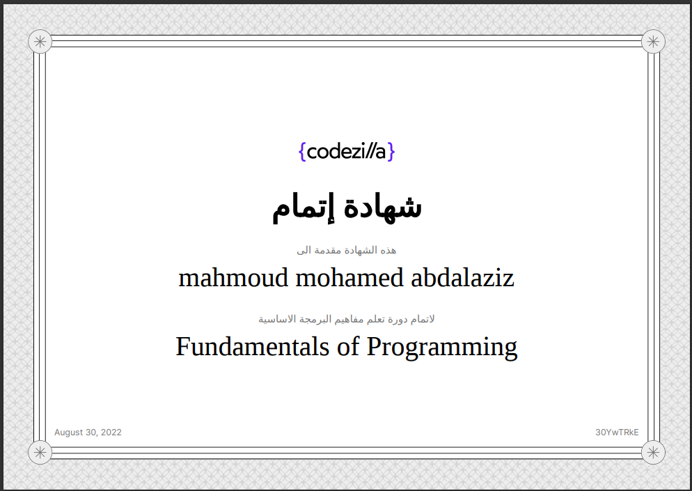
   - Source: [Codezilla Courses](https://www.codezilla.courses/)

3. **CS50x - edX - CS50**
   - [Certificate](./Certifications/CS50x/CS50x.pdf)
   - 
   - Source: [edX - CS50](https://www.edx.org/cs50)

4. **Foundations Level 1 - Programming Advices**
   - [Certificate](./Certifications/Foundations_Level_1/1.pdf)
   - 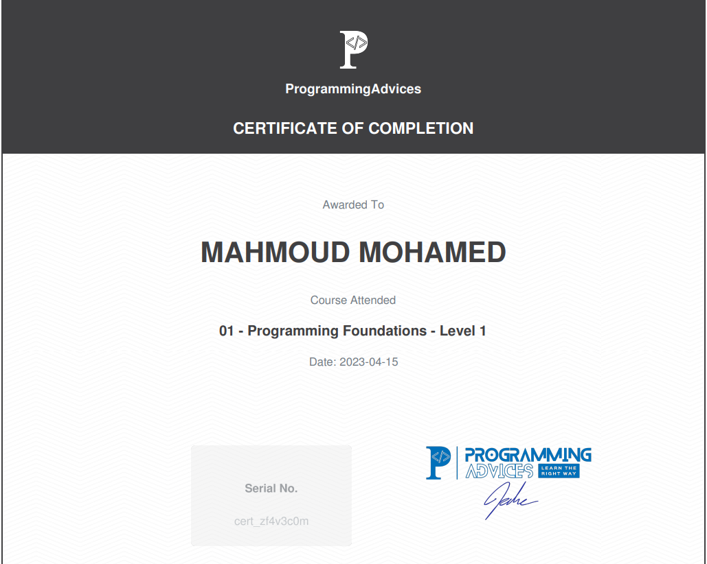
   - Source: [Programming Advices](https://programmingadvices.com/)

5. **Algorithms and Problem-Solving Level 1 - Programming Advices**
   - [Certificate](./Certifications/Algorithms_and_Problem-Solving_Level_1/1.pdf)
   - 
   - Source: [Programming Advices](https://programmingadvices.com/)

6. **Algorithms and Problem-Solving - Programming Advices**
   - [Certificate](./Certifications/Algorithms_and_Problem-Solving_Level_1_sol/1.pdf)
   - 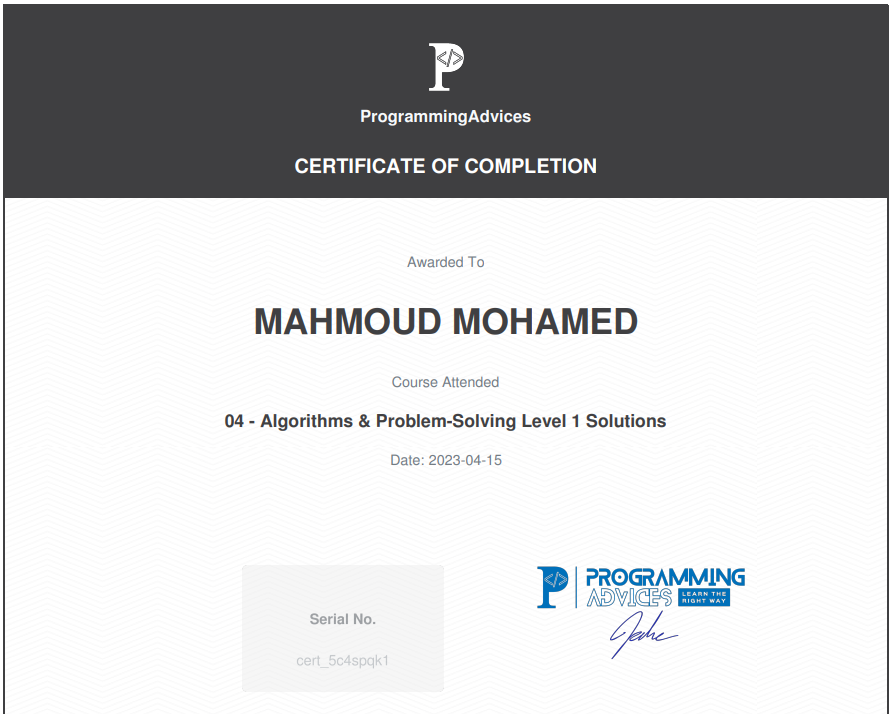
   - Source: [Programming Advices](https://programmingadvices.com/)

7. **Programming Using C++ Level 1 - Programming Advices**
   - [Certificate](./Certifications/Programming_Using_Cpp_Level_1/1.pdf)
   - 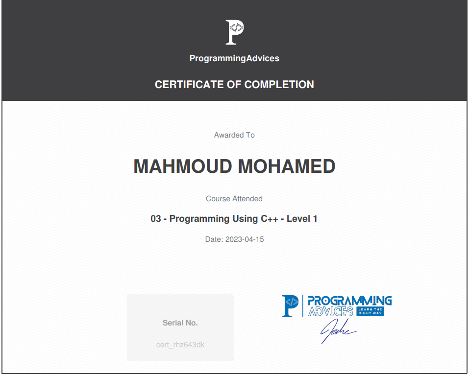
   - Source: [Programming Advices](https://programmingadvices.com/)

8. **Programming Using C++ Level 2 - Programming Advices**
   - [Certificate](./Certifications/Programming_Using_Cpp_Level_2/1.pdf)
   - 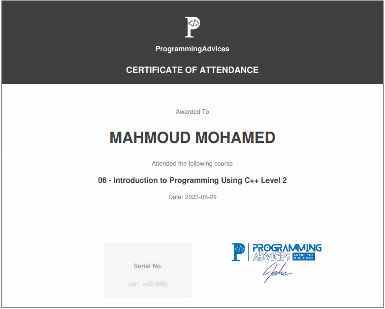
   - Source: [Programming Advices](https://programmingadvices.com/)

9. **Algorithms and Problem-Solving Level 3 - Programming Advices**
   - [Certificate](./Certifications/Algorithms_and_Problem-Solving_Level_2/1.pdf)
   - 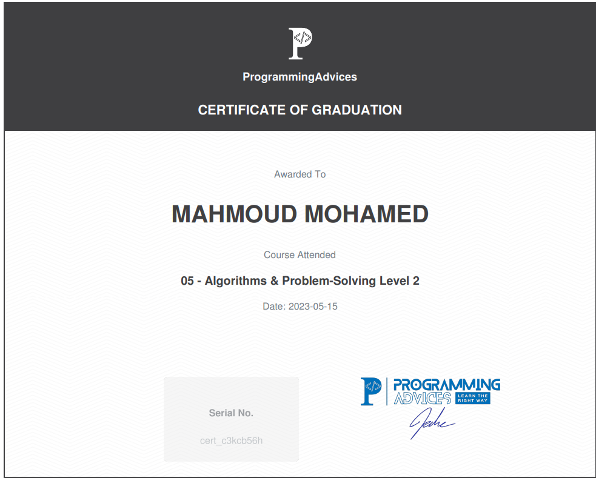
   - Source: [Programming Advices](https://programmingadvices.com/)

10. **Algorithms and Problem-Solving Level 4 - Programming Advices**
    - [Certificate](./Certifications/Algorithms_and_Problem-Solving_Level_3/1.pdf)
    - 
    - Source: [Programming Advices](https://programmingadvices.com/)

11. **OOP Concepts - Programming Advices**
    - [Certificate](./Certifications/OOP_Concepts/1.pdf)
    - 
    - Source: [Programming Advices](https://programmingadvices.com/)

12. **Algorithms and Problem-Solving Level 4 - Programming Advices**
    - [Certificate](./Certifications/Algorithms_and_Problem-Solving_Level_4/1.pdf)
    - 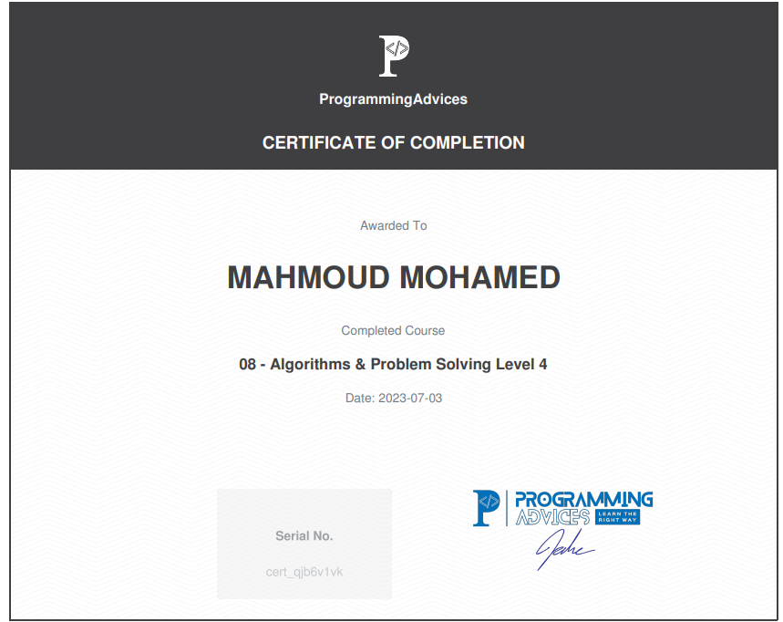
    - Source: [Programming Advices](https://programmingadvices.com/)

13. **OOP Applications - Programming Advices**
    - [Certificate](./Certifications/OOP_Applications/1.pdf)
    - 
    - Source: [Programming Advices](https://programmingadvices.com/)

14. **Data Structures - Programming Advices**
    - [Certificate](./Certifications/Data_Structures/1.pdf)
    - 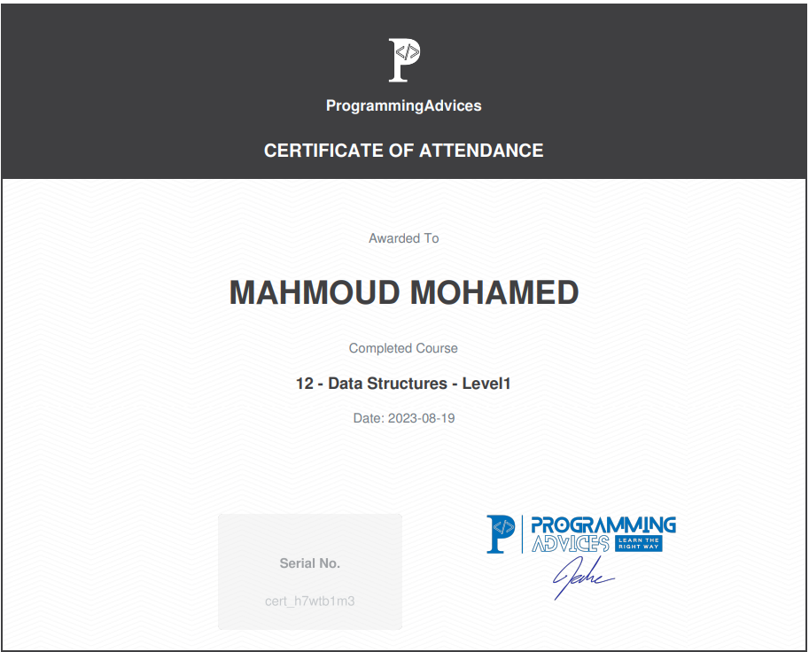
    - Source: [Programming Advices](https://programmingadvices.com/)

15. **Algorithms and Problem-Solving Level 4 - Programming Advices**
    - [Certificate](./Certifications/Algorithms_and_Problem-Solving_Level_5/1.pdf)
    - 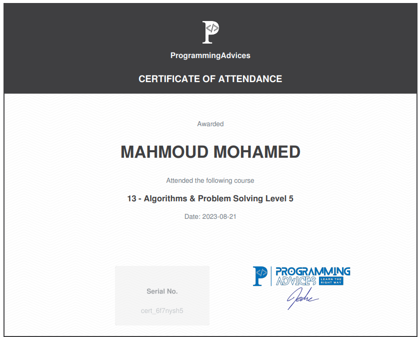
    - Source: [Programming Advices](https://programmingadvices.com/)

16. **OOP With C# - Programming Advices**
    - [Certificate](./Certifications/OOP_With_CSharp/0.pdf)
    - 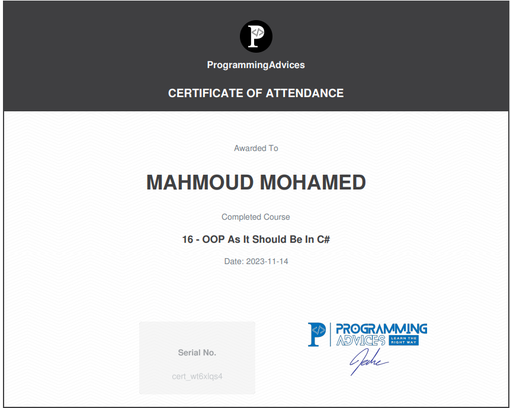
    - Source: [Programming Advices](https://programmingadvices.com/)

17. **Database Level1 SQL Concepts and Practice - Programming Advices**
    - [Certificate](./Certifications/Database_Level1_SQL_Concepts_and_Practice/0.pdf)
    - 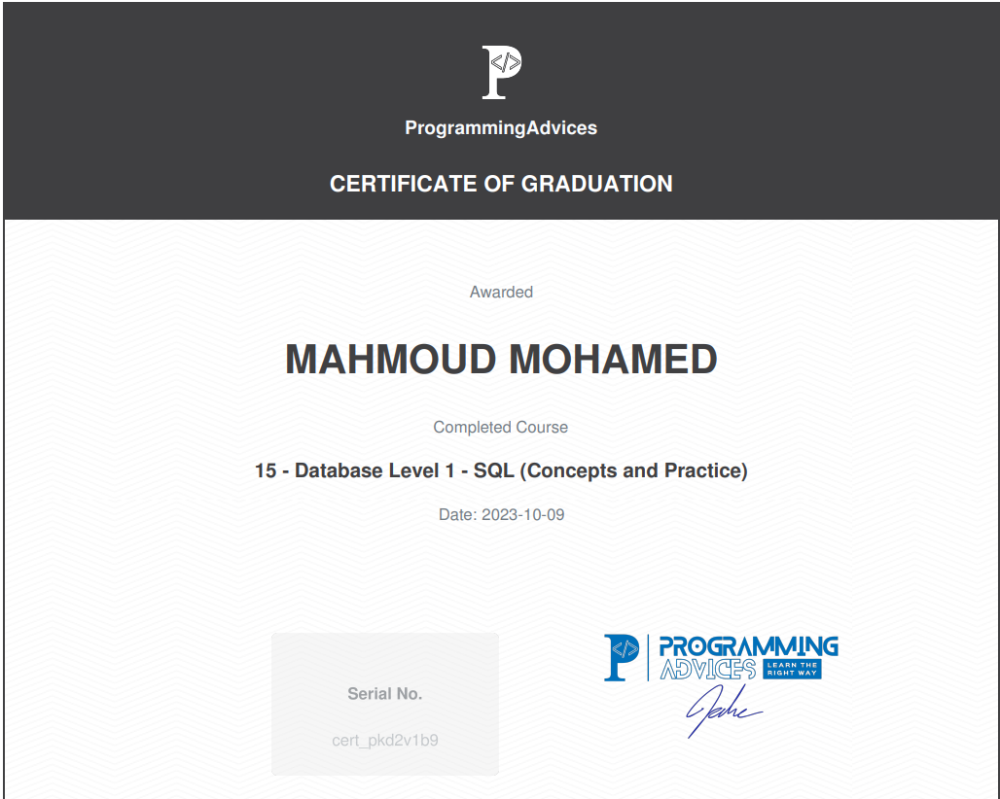
    - Source: [Programming Advices](https://programmingadvices.com/)

18. **Database Level1 SQL Projects and Practice - Programming Advices**
    - [Certificate](./Certifications/Database_Level1_SQL_Projects_and_Practice/0.pdf)
    - 
    - Source: [Programming Advices](https://programmingadvices.com/)

## About Me

I am a passionate learner and dedicated individual committed to personal and professional growth. These certifications reflect my ongoing pursuit of knowledge and excellence in the programming field. If you have any questions or wish to learn more about my journey, feel free to connect with me.

## Contact Information

- Email: [mahmoud.abdalaziz@outlook.com](mailto:mahmoud.abdalaziz@outlook.com)
- LinkedIn: [Mahmoud Mohamed Abdalaziz](https://www.linkedin.com/in/mahmoud-mohamed-abd/)

Feel free to reach out if you have any inquiries or want to connect!

---
> Note: The certifications included in this repository are personal achievements and may not be used for any unauthorized purposes without permission.
