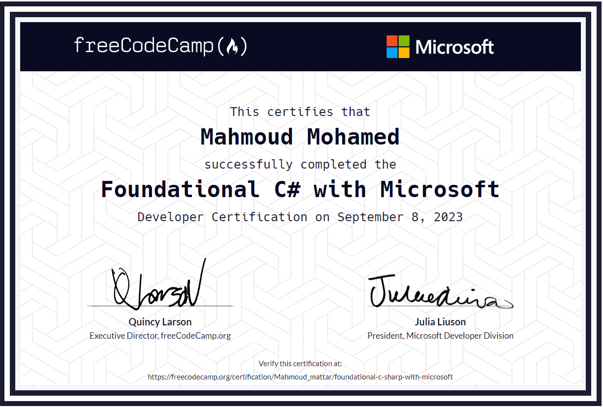
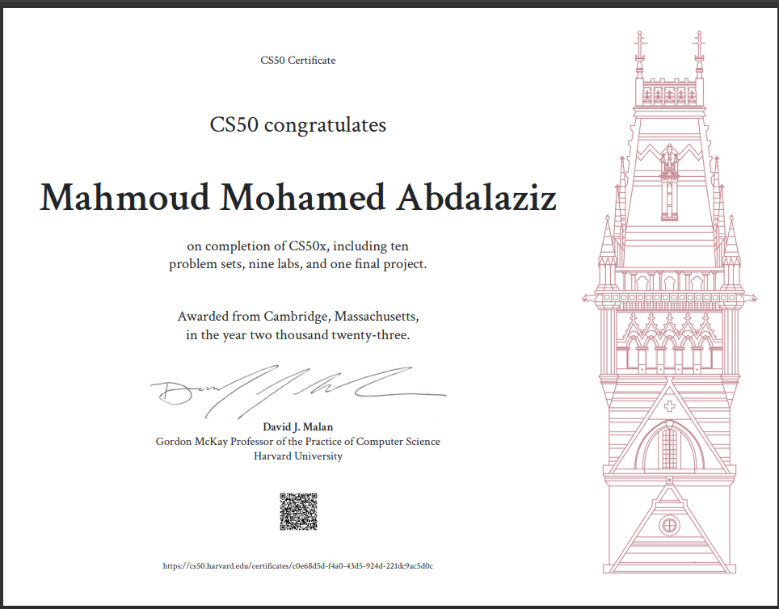

# My Certifications

Welcome to my "My Certifications" repository! This repository contains a collection of my certifications and achievements in Programing. Each certification represents a milestone in my learning journey, showcasing my dedication and expertise

Feel free to explore and take a look at the certifications I've earned over time. You'll find PDF files and details for each certification to learn more about the skills and knowledge I've acquired.

## Certifications

Here's a list of the certifications and achievements included in this repository:

0. 
   Source: 

   
0. [Fundamentals_of_Programming](./Certifications/codezilla/Fundamentals_of_Programming_certificate.pdf)
   
   Source: [Codezilla Courses](https://www.codezilla.courses/)

1. [CS50x](./Certifications/CS50x/CS50x.pdf)
   
   Source: [edX - CS50](https://www.edx.org/cs50)

2. [Foundations](./Certifications/Foundations_Level_1/1.pdf)
   
   Source: [Programming Advices](https://programmingadvices.com/)

3. [Algorithms and Problem-Solving Level 1](./Certifications/Algorithms_and_Problem-Solving_Level_1/1.pdf)
   
   Source: [Programming Advices](https://programmingadvices.com/)

4. [Algorithms and Problem-Solving](./Certifications/Algorithms_and_Problem-Solving_Level_1_sol/1.pdf)
   
   
   Source: [Programming Advices](https://programmingadvices.com/)

5. [Programming Using C++ Level 1](./Certifications/Programming_Using_Cpp_Level_1/1.pdf)
   
   
   Source: [Programming Advices](https://programmingadvices.com/)

6. [Programming Using C++ Level 2](./Certifications/Programming_Using_Cpp_Level_2/1.pdf)
   
   
   Source: [Programming Advices](https://programmingadvices.com/)

7. [Algorithms and Problem-Solving Level 3](./Certifications/Algorithms_and_Problem-Solving_Level_2/1.pdf)
   
     
   Source: [Programming Advices](https://programmingadvices.com/)

8. [Algorithms and Problem-Solving Level 4](./Certifications/Algorithms_and_Problem-Solving_Level_3/1.pdf)
   
   
   Source: [Programming Advices](https://programmingadvices.com/)

9. [OOP Concepts](./Certifications/OOP_Concepts/1.pdf)

   
   Source: [Programming Advices](https://programmingadvices.com/)

10. [Algorithms and Problem-Solving Level 4](./Certifications/Algorithms_and_Problem-Solving_Level_4/1.pdf)
    
    
    Source: [Programming Advices](https://programmingadvices.com/)

11. [OOP Applications](./Certifications/OOP_Applications/1.pdf)
    
    
    Source: [Programming Advices](https://programmingadvices.com/)

12. [Data Structures](./Certifications/Data_Structures/1.pdf)
    
    
    Source: [Programming Advices](https://programmingadvices.com/)

13. [Algorithms and Problem-Solving Level 4](./Certifications/Algorithms_and_Problem-Solving_Level_5/1.pdf)
    
    
    Source: [Programming Advices](https://programmingadvices.com/)

## About Me

I am a passionate learner and dedicated individual with a strong commitment to personal and professional growth. These certifications represent my continuous pursuit of knowledge and my desire to excel in the Programing field. If you have any questions about my certifications or want to learn more about my journey, feel free to connect with me.

## Contact Information

- Email: mahmoud.abdalaziz@outlook.com
- LinkedIn: [Mahmoud Mohamed Abdalaziz](https://www.linkedin.com/in/mahmoud-mohamed-abd/)

Feel free to reach out if you have any inquiries or want to connect!

---
> Note: The certifications included in this repository are personal achievements and may not be used for any unauthorized purposes without permission.
